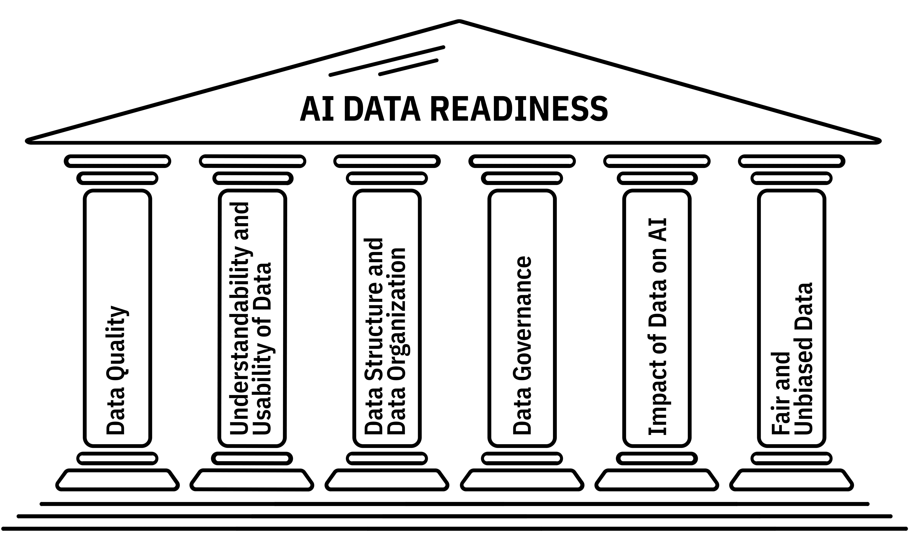

.. AIDRIN documentation master file, created by
   sphinx-quickstart on Wed Jul 23 13:03:56 2025.
   You can adapt this file completely to your liking, but it should at least
   contain the root `toctree` directive.

AIDRIN Documentation
====================

**AIDRIN** (AI Data Readiness Inspector) is an open-source tool designed to streamline the preparation and evaluation of datasets for artificial intelligence and machine learning workflows. AIDRIN enables researchers, data scientists, and developers to assess the quality, structure, and readiness of datasets through an intuitive, browser-based interface.

AIDRIN provides actionable, quantitative metrics to help evaluate datasets across multiple dimensions critical to AI and data science, including:

- **Data Quality**
- **Data Governance**
- **Data Understandability and Usability**
- **Fairness and Bias**
- **Impact on AI**
- **Data Structure and Organization**

Whether validating training data for machine learning models, ensuring responsible data stewardship, or preparing datasets for research and production, AIDRIN offers a practical and extensible solution.

Built with a modern technology stack including Flask, Celery, and Redis, AIDRIN is lightweight yet powerful. Its asynchronous architecture supports scalable data processing, and its interactive design ensures accessibility for users across technical levels.

Key Features
------------

- **Comprehensive Data Readiness Metrics**: Assess datasets using well-defined indicators across multiple dimensions.
- **Interactive Web Dashboard**: Explore and analyze datasets via a responsive, user-friendly interface.
- **Lightweight & Modular Architecture**: Designed for adaptability, extensibility, and ease of integration.
- **Scalable Backend Infrastructure**: Powered by Flask for the web interface, Celery for background processing, and Redis for reliable task management.

.. toctree::
   :maxdepth: 2
   :caption: Contents:

   installation
   usage
   appfl_integration
   contributing
   publications
